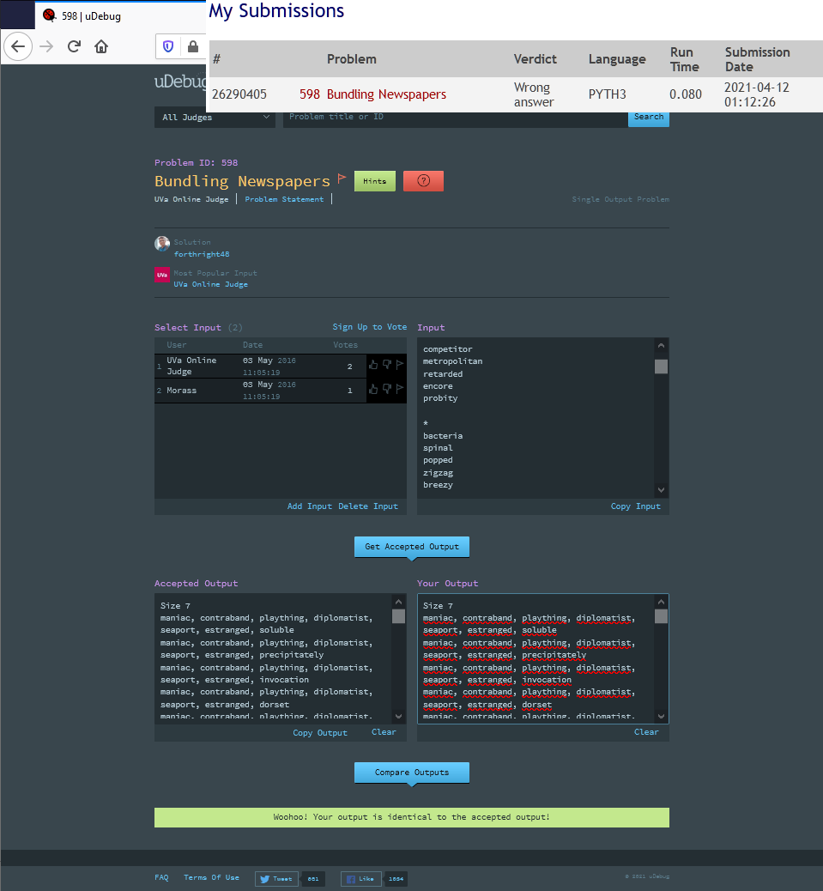

___

 

## 00598 - Bundling Newspapers
# **Análise e Complexidade de Algoritmos**

 

___

## Resposta do Trabalho 01 | 2.1 - Busca Completa: 00598

 

**Author: Dornélio Mori Junior**

**Affil: PPComp — Campus Serra, Ifes**

**Date: 2021/04**

 

___

 

### **1) Breve explicação de como a técnica indicada foi utilizada**

Para este problema foi utilizada a estratégia de Busca Completa. Foi realizado uma varredura sequencial (de palavra a palavra) utilizando Recursividade, onde é montado cada linha de OutPut.

Após entrada dos dados e interpretação correta dos Sizes (tamanhos a serem exibidos/combinados), são produzidas todas as combinações de maneira ordenada e sem repetição.
Por algum problema que eu não soube identificar até o presente momento, o output não recebeu "Accepted" (Recebeu "Wrong answer") Judge porém recebeu Match no uDebug, conforme imagem:

 

 

Foi realizado diversas tentativas e diversos códigos, todos apresentavam o mesmo resultado.
Nó código estou enviando os 3 códigos (2 estarão comentados) que modifiquei para verificar se havia algum problema. Todos tiveram o mesmo resultado ((Recebeu "Wrong answer") Judge porém recebeu Match no uDebug)

### **2) Análise da complexidade de tempo do programa desenvolvido**
Para encontrar a solução o programa usou como base a estratégia de Busca Completa com a técnica de Recursividade (onde sua complexidade normalmente é de **O(n)** dependendo das suas operações internas), mas também foram necessárias outras codificações necessárias para completa o código. 

Como este algoritmo trata de um problema que envolve combinações sem repetição podemos considerar que sua base de complexidade é a de um algoritmo de combinação, que normalmente é de $O(2^n)$.

Sendo assim, analisando o algoritmo foi identificado a complexidade de tempo desse programa sendo de grandeza $O(2^n)$. A complexidade completa (reduzida) encontrada foi de $T(n) = (m^n)$ no pior caso (quanto temos somente # como regras), desconsiderando algumas operações para a leitura do input. Onde:

### **3) Outras informações que o autor julgar apropriadas para o entendimento do trabalho realizado**
_[N/A]_

 

___