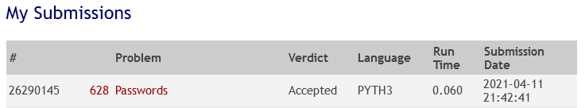

___

<br>

## 00628 - Passwords
# **Análise e Complexidade de Algoritmos**

<br>

___

## Resposta do Trabalho 01 | 2.1 - Busca Completa: 00628

<br>


**Author: Dornélio Mori Junior**

**Affil: PPComp — Campus Serra, Ifes**

**Date: 2021/04**

<br>

___

<br>

### **1) Breve explicação de como a técnica indicada foi utilizada**


Para este problema foi utilizada a estratégia de Busca Completa. Foi realizado uma varredura sequencial (de palavra a palavra) utilizando Recursividade, onde é montado cada linha de OutPut.

````
Rule(#0#)
[    #   ]->[     0   ]->[      #       ]->[   output   ]
.() admin ->(0) admin0 ->(#) admin0admin -> "admin0admin"
            (0) admin2 ->(#) admin1admin -> "admin1admin"
            (0) ...
            (0) admin9 ->(#) admin9admin -> "admin9admin"
````

````
Rule(0#0#...#)
[  0  ]->[   #   ]->[    0    ]->[       #     ]->[       ...       ]->[          #       ]->[      output     ]
.(0) 0 ->(#)0text ->(0) 0text0 ->(#) 0text0text ->(...)0text0text... ->(#)0text0text...text->"0text0text...text"
                                                ->(...)0text0text... ->(#)0text0text...text->"0text0text...text"
                                                ->(...)0text0text... ->(#)0text0text...text->"0text0text...text"
												->(...)
.(0) 0 ->(#)0text ->(0) 0text1 ->(#) 0text1text ->(...)0text1text... ->(#)0text1text...text->"0text1text...text"
                    (0)  ...   ->(#) 0text.text ->(...)0text.text... ->(#)0text.text...text->"0text........text"
                    (0)  ...   ->(#) 0text.text ->(...)0text.text... ->(#)0text.text...text->"0text........text"
                    (0) 0text9 ->(#) 0text9text ->(...)0text9text... ->(#)0text9text...text->"0text9text...text"
.(0) 1 ->(#)1text ->(0) 1text1 ->(#) 1text1text ->(...)1text1text... ->(#)1text1text...text->"1text1text...text"
                    (0)  ...   ->(#) 1text.text ->(...)1text.text... ->(#)1text.text...text->"1text........text"
                    (0)  ...   ->(#) 1text.text ->(...)1text.text... ->(#)1text.text...text->"1text........text"
                    (0) 1text9 ->(#) 1text9text ->(...)1text9text... ->(#)1text9text...text->"1text9text...text"
.(0)...->(#).text ->(0) .text1 ->(#) .text1text ->(...).text1text... ->(#).text1text...text->".text1text...text"
                    (0)  ...   ->(#) .text.text ->(...).text.text... ->(#).text.text...text->".text........text"
                    (0)  ...   ->(#) .text.text ->(...).text.text... ->(#).text.text...text->".text........text"
                    (0) .text9 ->(#) .text9text ->(...).text9text... ->(#).text9text...text->".text9text...text"
.(0) 9 ->(#)9text ->(0) 9text1 ->(#) 9text1text ->(...)9text1text... ->(#)9text1text...text->"9text1text...text"
                    (0)  ...   ->(#) .text.text ->(...).text.text... ->(#).text.text...text->".text........text"
                    (0)  ...   ->(#) .text.text ->(...).text.text... ->(#).text.text...text->".text........text"
                    (0) 9text9 ->(#) 9text9text ->(...)9text9text... ->(#)9text9text...text->"9text9text...text"					
````

<br>



<br>

### **2) Análise da complexidade de tempo do programa desenvolvido**
Para encontrar a solução o programa usou como base a estratégia de Busca Completa com a técnica de Recursividade (onde sua complexidade normalmente é de **O(n)** dependendo das suas operações internas), mas também foram necessárias outras codificações necessárias para completa o código. 

Cada chamada resolve parte do problema.

Sendo assim, analisando o algoritmo foi identificado a complexidade de tempo desse programa sendo de grandeza $O(n^n)$. A complexidade completa (reduzida) encontrada foi de $T(n) = (m^n)$ no pior caso (quanto temos somente # como regras), desconsiderando algumas operações para a leitura do input. Onde:

_$m$: Número de Regras_
_$n$: Número de Palavras no dicionário_
_$t$: Número de Testes_

$$
\begin{equation} T(n) = 
	\begin{cases} 
			1 & \text{se}~n = 1 \\
		     tmn^m + 2tm + 3tn + 11t & \text{caso contrário}\\
	\end{cases}
\end{equation}
$$

A análise de complexidade pode ser vista abaixo.

<br>


<br>

### **3) Outras informações que o autor julgar apropriadas para o entendimento do trabalho realizado**
_[N/A]_

<br>

___
