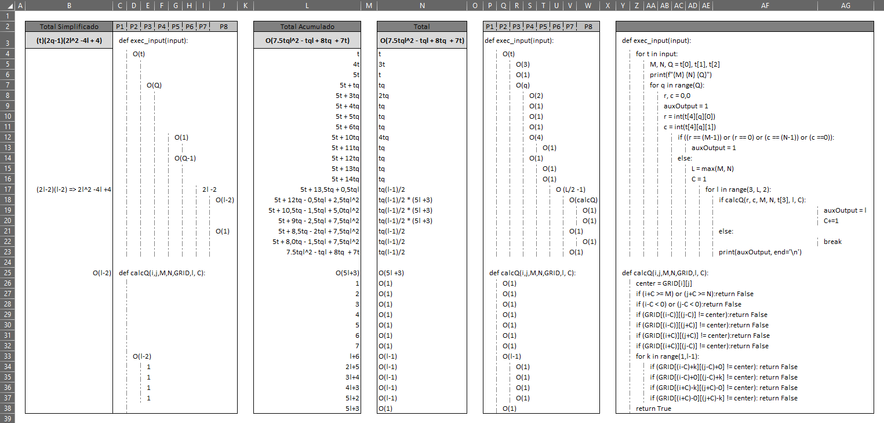

___

 

## 10908 - Largest Square
# **Análise e Complexidade de Algoritmos**

 

___

## Resposta do Trabalho 01 | 2.1 - Busca Completa: 10908

 

**Author: Dornélio Mori Junior**

**Affil: PPComp — Campus Serra, Ifes**

**Date: 2021/04**

 

___

 

### **1) Breve explicação de como a técnica indicada foi utilizada**

Para este problema foi utilizada a estratégia de Busca Completa. Foi realizado uma varredura sequencial (de ponto a ponto)(força bruta|busca completa) no GRID a parti do centro [r,c] buscando uma condição que o fizesse parar (carácter diferente do centro) e com isso obter a posição da última camada válida.

Algumas observações do problema:
1) Com o ponto dado (r, c) é o CENTRO DO OBJETO, temos:
1.1) Sempre vai ser um quadro (a não ser quando for um ponto).
1.2) O output sempre vai ser impar.
1.3) A formação dos objetos pode ser consideradas por CAMADAS. 
1.3.1)A Formação do CAMADA/PERIMETRO: (1X1:1)(3X3:9)(5X5:25)(7X7:49)(9X9:81)(11X11:121)(13X13:169)
     (C)CAMADA = 0( CENTRO), quando o quadrado é formado por apenas 1 elemento. E l=1.
     (C)CAMADA = 1. Camada depois da CAMADA 0(Centro). O l=3, ou seja, Camada formada com laterais de tamanho 3.
     (C)CAMADA = x. Camada x depois da Camada0.

 

 

### **2) Análise da complexidade de tempo do programa desenvolvido**
Para encontrar a solução o programa usou como base a estratégia de Busca Completa (Força Bruta)(onde sua complexidade normalmente é de **O(n²)**, mas também foram necessárias outras codificações necessárias para completa o código. 

Analisando o algoritmo foi identificado a complexidade de tempo desse programa sendo de grandeza **O(n²)**. A complexidade completa (reduzida) encontrada foi de **T(n) = (7.5 t q l² - t q l + 8 t q  + 7t)**, desconsiderando algumas operações para a leitura do input. Onde:

_**t**: Número de Casos de Testes_
_**q**: Número de Testes de Ponto Centro_
_**l**: Número Máximo entre M e N (dos lados)_

$$
\begin{equation} T(n) = 
	\begin{cases} 
			1 & \text{se}~n = 1 \\
			 7,5 t q l^2 - tql + 8tq + 7t & \text{caso contrário}
	\end{cases}
\end{equation}
$$

Em uma tentativa de obter uma Complexidade mais simplificada, foi reduzido a análise desconsiderando custos irrelevantes (O(1)), como atribuição de variáveis, append em listas, etc.
Desta forma, a complexidade completa (simplificada) encontrada foi de **T(n) = (t)(2q - 1)(2l² - 4l + 4)**

$$
\begin{equation} T(n) = 
	\begin{cases} 
			1 & \text{se}~n = 1 \\
			 (t)*(2q-1)*(2l^2-4l+4) & \text{caso contrário}
	\end{cases}
\end{equation}
$$

A análise de complexidade pode ser vista abaixo.

 

 

### **3) Outras informações que o autor julgar apropriadas para o entendimento do trabalho realizado**
_[N/A]_

 

___