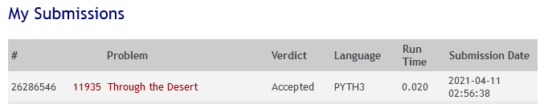
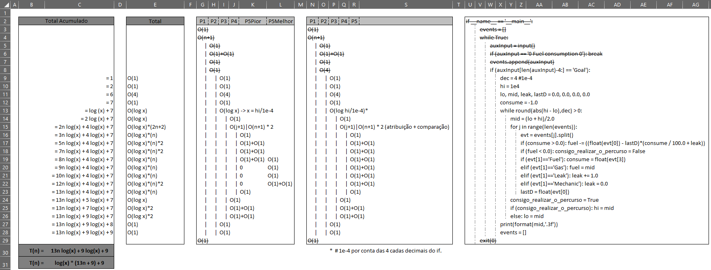

___

 

## 11935 - Through the Desert
# **Análise e Complexidade de Algoritmos**

 

___

## Resposta do Trabalho 01 | 2.2 - Dividir e Conquistar: 11935

 

**Author: Dornélio Mori Junior**

**Affil: PPComp — Campus Serra, Ifes**

**Date: 2021/04**

 

___

 

### **1) Breve explicação de como a técnica indicada foi utilizada**
Inicialmente foi feito um algorítimo de Pesquisa Completa (Busca Sequencial) para chegar ao resultado e entender melhor a geração dos resultados.

Baseado na forma como os cálculos foram gerados consegui identificar uma forma de implementar com a técnica Dividir e Conquistar com o algoritmo de Pesquisa/Busca Binária.

Baseado na forma como a técnica Dividir e Conquistar foi utilizada no problema anterior (10706 - Number Sequence) foi estimado um valor máximo (grande suficiente) para o resultado de menor valor possível no tanque para realizar o eventos (da mesma forma que foi informado no problema 10706, o digito da posição 2147483647).

Para estimar, poderíamos simplesmente jogar um valor alto (ex.: 10^10) ou estimar algo aproximado para que reduzidíssimos o tempo (quantidade de divisões) para encontrar a solução.

Com base no problema, temos o máximo de 30 (como consumo), 50 de eventos, e inicialmente 3 dígitos de deslocamento (999), mas na base de testes isso poderia chegar a quantos dígitos ele quisesse testar. Mas tomamos como base inicial esse valor 30 * 50 * 999 = 1498500, teríamos em um pior caso onde se percorre 999km com o consumo de 30L o Volume mínimo do tanque de combustível com 1.498.500L (o que é um pouco improvável). Mas assumindo que não seja restrito a esse valor, foi aumentado o deslocamento para 5 dígitos (99999) e com isso foi feito uma análise do comportamento do algoritmo para verificar se esse range era o suficiente para a nossa solução. Após teste no Judge, foi identificado que 5 dígitos eram suficientes para chegarmos na solução. Porém como foi um valor estimado por alta, foi testado valores menores para verificar um ponto (Range) menor a ser aceito pelo Judge. Após esses teste foi identificado que 10.000L (\~9999 4 dígitos) era um valor aceitável para nossa solução máxima nesse problema. Por curiosidade, testei com dígitos maiores para verificar se o algorítimo extrapolava o tempo limite permitido. 10^8 e 10^9 (\~9999999, \~99999999, 4 e 5 dígitos respectivamente) foram aceitos sem nenhum problema no Judge.

Com esse valor determinado (10.000L = 1e4), agora podemos fazer o processo de Dividir e Conquistar (com Busca Binária) e Simular cada Resultado (Menor Volume no Tanque para percorrer o Evento) até encontrarmos hi = lo (precisão de 4 casas decimais), e com isso sabemos qual o valor seria/será o resultado (mínimo). Por exemplo: 10^4L atende o evento? Se sim, então divide a base e o novo hi é 10^4 / 2. 10^4/2 atende o evento? etc... até encontrar o ponto em que hi = lo (precisão de 1e-4).

Todos esses teste foram indicados como "Accepted" no Online Judge.

 

 

### **2) Análise da complexidade de tempo do programa desenvolvido**
O programa tem como parte da solução uma Busca Binária (onde sua complexidade padrão é de **O(log_2 n)**, mas também tem outras codificações necessárias para encontrar a solução. Sem contar o ponto importante de que definimos nossa base máxima (um range de 1e4L) para encontrarmos nosso resultado. Desta forma a Busca Binária será realizado em cima desta base de solução e sua complexidade para este algoritmo fica em **O(log_2 1e4/1e-4)**, onde 1e-4 é a precisão de casas decimais definida no problema.

Analisando o restante do algoritmo foi identificado a complexidade de tempo desse programa sendo de grandeza **O(n)**.
A complexidade completa (reduzida) foi de **T(n) = (13n * log_2(1e4/1e-4)) + (9 * log_2(1e4/1e-4)) + 9**, desconsiderando algumas operações para a leitura do input.

A análise de complexidade pode ser vista abaixo.

 

 

### **3) Outras informações que o autor julgar apropriadas para o entendimento do trabalho realizado**
_[N/A]_

 

___
