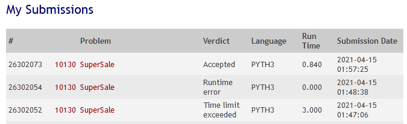

___

 

## 10130 - Super Sale
# **Análise e Complexidade de Algoritmos**

 

___

## Resposta do Trabalho 02 | 2.1 - Programação Dinâmica: 10130

 

**Author: Dornélio Mori Junior**

**Affil: PPComp — Campus Serra, Ifes**

**Date: 2021/04**

 

___

 

### **1) Breve explicação de como a técnica indicada foi utilizada**
Foi utilizado a técnica de Programação Dinâmica para este problema.

O objetivo do problema é maximizar o valor que cada pessoa pode carregar (lembra um pouco o problema dos bastões).
Para isso devemos percorrer todas as opções (combinações) de quanto cada uma pessoa consegue carregar e ir selecionando a melhor combinação para aquela pessoa (ir maximazando o quanto ela pode carregar).

Foi realizado inicialmente uma abordagem Botton-Up (quase uma busca sequencial, porem com seus parâmetros acertados e fazendo o mesmo utilizando-se uma cache/memo) e seu código foi aceito para gerar todos os teste do uDebug, porém teve seu limite de tempo estourado no Judge. Sendo assim, foi realizado diversas tentativas para construir na abordagem Top-Down e o mesmo só foi aceito com a utilização de uma biblioteca para realizar o cache/memo.

Dentro do arquivo está sendo enviado os dois código, o principal será o que foi aceito pelo Judge.

Todos esses teste foram indicados como "Accepted" no Online Judge.

 

 

### **2) Análise da complexidade de tempo do programa desenvolvido**

Abordagem Botton-Up: T(n): Mem(N) + DP(G*N*MW)
Abordagem Top-Down:  Não finalizei os calculos.

 

### **3) Outras informações que o autor julgar apropriadas para o entendimento do trabalho realizado**
_[N/A]_

 

___
