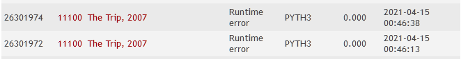

___

 

## 11264 - Coin Collector
# **Análise e Complexidade de Algoritmos**

 

___

## Resposta do Trabalho 02 | 2.2 - Algoritmos Gulosos: 11100

 

**Author: Dornélio Mori Junior**

**Affil: PPComp — Campus Serra, Ifes**

**Date: 2021/04**

 

___

 

### **1) Breve explicação de como a técnica indicada foi utilizada**
Foi utilizado a técnica Gulosa para este problema.

Todos esses teste foram indicados como "OK" no uDebug, não consegui rodar no Judge estava dando algum erro para as entradas de dados.

 

 

### **2) Análise da complexidade de tempo do programa desenvolvido**
A abordagem Gulosa neste problema tem complexidade *O(n)* pois ela passa por todos os $n$ para ir comparando as condições (tec.Gulosa)  

 

### **3) Outras informações que o autor julgar apropriadas para o entendimento do trabalho realizado**
_[N/A]_

 

___
