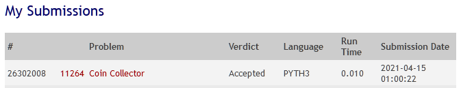

___

 

## 11264 - Coin Collector
# **Análise e Complexidade de Algoritmos**

 

___

## Resposta do Trabalho 02 | 2.2 - Algoritmos Gulosos: 11264

 

**Author: Dornélio Mori Junior**

**Affil: PPComp — Campus Serra, Ifes**

**Date: 2021/04**

 

___

 

### **1) Breve explicação de como a técnica indicada foi utilizada**
Foi utilizado a técnica Gulosa para este problema.
Com o vetor ordenado primeiramente foi realizado o teste de tras para frente (32-16, 16-8, 8-4,...2-1,1-1 = 6 moedas), os primeiros testes deram Ok.
Mas quando pegamos alguns teste do uDebug percebemos que essa abordagem não funciona.
Não funciona pois essa Abordagem Gulosa não considera o número máximo de moeda que o Sultão pode ter, pois ele vindo de trás para frente ele não garante que vai ter o máximo de moedas mas garante que vai ter as mais altas (valores maiores) moedas.
Sendo assim a abordagem foi mudada de tras pra frente para inicio/fim, onde assim conseguimos garantir que teremos mais moedas considerando primeiramente as moedas menores.

Onde a soma das moedas(X) + a moeda(i) deve ser menor que o valor da moeda(i+1), pois se tivermos (1 + 3) + (6) = 10 [sum+moeda(i)] e a proximo moeda for 8, quando aplicamos withdraw(X) para X=10 o banco retornaria as moedas 8|1|1.bit_length
Sendo assim pulamos essa moeda e seguimos para a próxima.

Ex.:Para a entrada [1 3 6 8 15 20]
A forma "Gulosa" de considerarmos seria: 1|3|8|20

Todos esses teste foram indicados como "Accepted" no Online Judge.

 

 

### **2) Análise da complexidade de tempo do programa desenvolvido**
A abordagem Gulosa neste problema tem complexidade *O(n)* pois ela passa por todos os $n$ para ir comparando as condições (tec.Gulosa)  

 

### **3) Outras informações que o autor julgar apropriadas para o entendimento do trabalho realizado**
_[N/A]_

 

___
